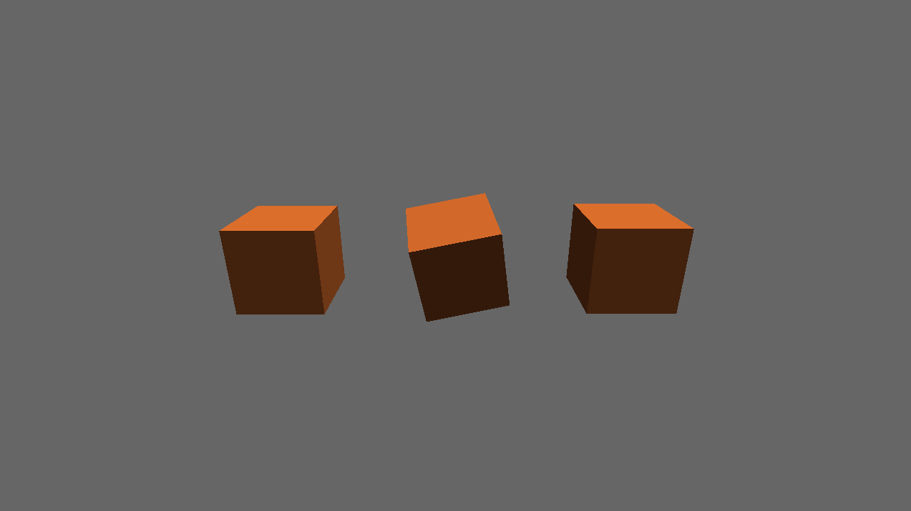
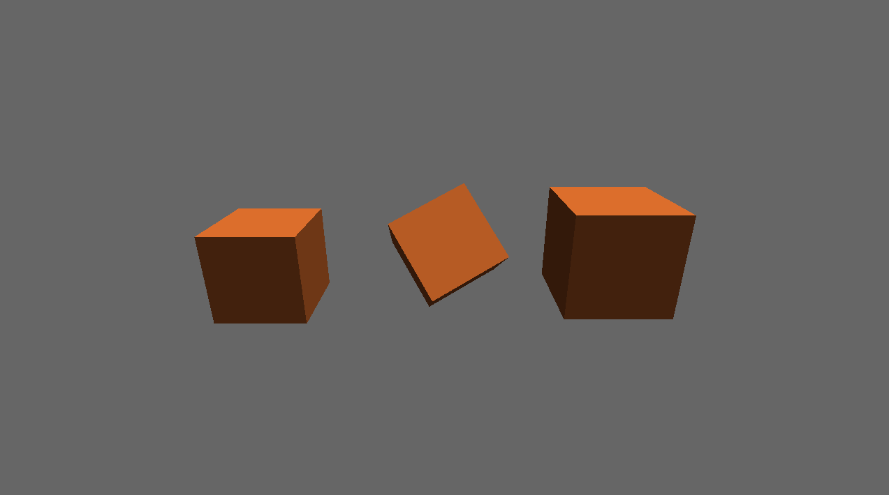

# EblanEngine


**EblanEngine** is a game development engine written in **C++20**.  
It's designed with an object-oriented approach and is currently in active development.

> ⚠️ **Note**: This is my first time working with OpenGL and writing a game engine from scratch. I'm still learning, so the code might not be perfect — but hey, it works (sometimes)!

---

## Current Features

- **Entity Component System (ECS)** — basic implementation with `EntityRegistry` and `EntityId`
- **Math library** — `Transform`, `Matrix4`, `Vector`, `Quaternion`
- **Rendering** — `WorldRender`, `MeshRenderer`, `OpenGLDevice`
- **First scene** — can render a basic 3D scene

---

## Tech Stack

- **Language:** C++20
- **Build System:** [Xmake](https://xmake.io/)
- **Renderer:** OpenGL (Vulkan and DirectX 12 support planned)
- **Physics:** [JoltPhysics](https://github.com/jrouwe/JoltPhysics) (planned)

---

## Build Instructions

### Prerequisites

#### Windows

1. Install **Visual Studio** with the following workloads:
    - Desktop development with C++
    - Game development with C++ (minimum)
    - (Optional) Linux and embedded development with C++ (for cross-platform)
    - (Optional) Mobile development with C++

   Make sure **MSVC** (latest version) is installed under "Individual components".

2. Install **Xmake**:
   ```bash
   winget install xmake
   ```
   Or download from: [xmake.io](https://xmake.io/)

#### Linux
Install required packages:
```bash
sudo apt-get update
sudo apt-get install -y \
    curl \
    clang-17 \
    libgl1-mesa-dev \
    libglu1-mesa-dev \
    libxext-dev \
    libx11-dev \
    libxrandr-dev \
    libxinerama-dev \
    libxcursor-dev \
    libxi-dev \
    libxfixes-dev \
    libxrender-dev \
    libxss-dev \
    libxtst-dev \
    build-essential \
    pkg-config
```

> Note: Package names may vary depending on your Linux distribution.

Install Xmake:
```bash
curl -fsSL https://xmake.io/shget.text | bash
```

---

## Building the Engine

### With Visual Studio (Windows)
1. Generate Visual Studio solution:
   ```bash
   xmake project -k vsxmake
   ```
2. Open the generated solution file:
   ```text
   /vsxmake2022/EblanEngine.sln
   ```
   (Year may vary — vsxmake2019 for VS 2019, etc.)

### With VSCode / CLion (Any platform)
1. Install the Xmake plugin(and clagd for VSCode)
   * [Xmake plugin for VSCode](https://marketplace.visualstudio.com/items?itemName=tboox.xmake-vscode)
   * [Xmake plugin for CLion](https://plugins.jetbrains.com/plugin/17406-xmake)
   * [Instruction for other IDEs](https://xmake.io/guide/extensions/ide-integration-plugins.html)
2. Generate compile_commands.json:
   ```bash
   xmake project -k compile_commands
   ```
3. Build the project:
   ```angular2html
   xmake build -v
   ```
4. Run the application:
   ```bash
   xmake run EblanEngineApp
   ```
   
---

## Example
Check out the working scene render in [/src/app/main.cpp](src/app/main.cpp)




---

## Roadmap(planned)
* Vulkan / DirectX 12 support
* Jolt Physics Integration
* Full ECS with systems
* Asset pipeline
* Editor

---

## Contributing
See [CONTRIBUTING.md](CONTRIBUTING.md)

---

## License
This project is licensed under the ISC License - see [LICENSE](LICENSE) file for details.